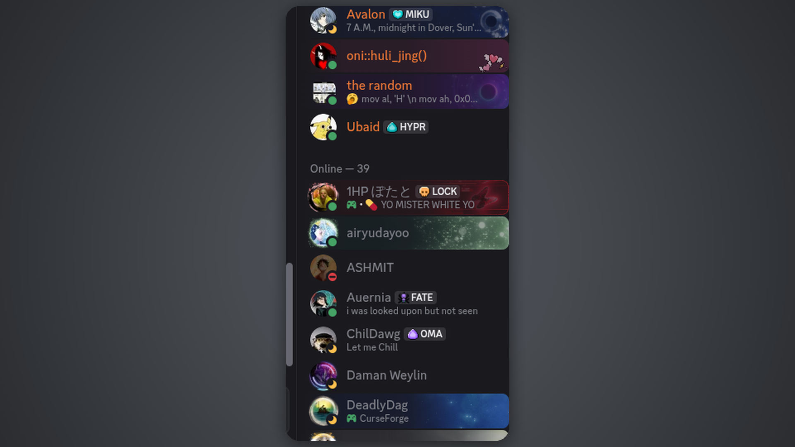

# Emoji

A quick emoji picker for Ryoku. Open it from anywhere, type to search, arrow-key
to select, and copy (or insert) any emoji without leaving your keyboard.



## What it does

- **Search** the full Unicode emoji catalogue (3944 emojis, 9 groups) with a
  single search box - names and codepoints both match.
- **Arrow keys** move a selection cursor around the grid; **Enter** copies (or
  inserts) the highlighted emoji. Type any letter and it just goes into the
  search box.
- **`wl-copy` clipboard** under the hood, so copy works on every Wayland
  compositor (Hyprland, niri, sway, ...). No compositor-specific IPC is used.
- Optional **type-into-window** mode that pastes the emoji through the
  virtual-keyboard protocol (`wtype`) instead of a compositor paste shortcut.
- Category chips filter by emoji group; scroll a long result set with the wheel;
  right-click a cell to force-copy.

## Install

- **Ryoku Settings -> Plugins -> Discover -> Emoji -> Install**, then enable it
  as a **Frame popout** (super: `.` to toggle; or the plugins menu). The
  default landing is the bottom-right of the frame with 8 columns.

## How it plugs in

The shell owns the popout surface - hover or a keybind melts it out of the frame
edge - and mounts `content/Widget.qml` at `full` density, laying it out at the
size it reports. This plugin ships two pieces:

- `service/Main.qml` - the persistent logic: it holds the catalogue, the query
  and group, the filtered results, your settings, and the copy/insert command.
  It loads `data/emojis.json` once and keeps state while the popout opens and
  closes (`main` entry point).
- `content/Widget.qml` - the search-chips-grid view. It reads everything from
  the service via `pluginApi.mainInstance` and forwards picks back to it
  (`content` entry point).

`hosts` in `manifest.json` lists where it can render (`framePopout`);
`defaults.host` is where it lands when first enabled. The emoji catalogue
`data/emojis.json` is generated from the Unicode `emoji-test.txt` data set and
contains every fully-qualified Unicode 17.0 emoji, grouped by category.

## Settings

| Key               | Default | Meaning                                            |
| ----------------- | ------- | -------------------------------------------------- |
| `action`          | `copy`  | What Enter does: `copy` to clipboard or `insert` into the focused window. |
| `closeAfterPick`  | `true`  | Close the popout after a pick.                     |
| `columns`         | `8`     | Emoji grid columns (4-16).                         |

Settings are declared as the `metadata.settings` schema in `manifest.json`; the
shell renders the form in the plugin's menu and persists changes to
`pluginApi.pluginSettings`.

## Develop

```
emoji/
  manifest.json             # id, version, entry points, hosts, settings schema
  product-manifest.json     # store install spec (hashes, modes)
  service/Main.qml          # main: catalogue, search, pick action
  content/Widget.qml        # content: the adaptive view
  content/components/Chip.qml  # the category chip
  data/emojis.json          # generated emoji catalogue (Unicode 17.0)
  data/emoji-test.txt       # the source data set
  bin/ryoku-emoji           # compositor-independent copy/insert helper
  assets/preview-popout.png # the README image
```

The catalogue can be regenerated from `data/emoji-test.txt`. The service and
content are plain QML against `Ryoku.PluginKit`; see `plugins/AUTHORING.md` for
the full guide.

## Credits

Part of Ryoku, MIT-licensed. Emoji catalogue from the Unicode Consortium's
`emoji-test.txt` (Unicode 17.0).