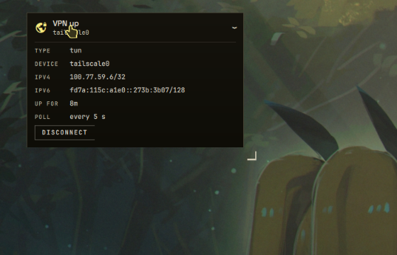

# VPN

A community plugin for the [Ryoku](https://ryoku.dev) desktop. It watches your
VPN and lets you switch it from the top bar (a single mark that opens a panel) or
from a card on the wallpaper. It knows two backends and shows whichever you have.

## What it does

- **On the bar** it rides as one Material mark, `vpn_lock` in the accent when a
  tunnel is up and `vpn_key_off` in the dim ink when none is, with the
  connection name or IP beside it. A left click opens the plugin's bar panel; the
  mark itself never changes the network.
- **The panel** (and the desktop card) show the tunnel's details and the switches
  that turn it on or off.

### Backends

**Tailscale** (when the `tailscale` command is present). The panel shows a switch
and the dossier: device (host name), name (MagicDNS name), IPv4 (with a COPY
button), IPv6, tailnet, exit node (with STOP USING when one is active), relay,
peers online/total, and version, plus any health warnings Tailscale reports. An
ADMIN CONSOLE button opens your machines page.

**NetworkManager**. Every VPN and WireGuard profile NetworkManager knows, each
with a switch; an active profile also shows its device, IPv4 and gateway.

## Settings

| Key | Type | Default | What it does |
|---|---|---|---|
| `poll` | int (3..60) | `10` | Seconds between refreshes. |
| `barLabel` | choice `none`/`name`/`ip` | `name` | What rides beside the bar mark. |
| `confirmOff` | toggle | `true` | Ask before turning off a VPN that is using an exit node. |

Turning off an exit-node Tailscale tunnel arms once (`TURN OFF? traffic leaves
the exit node`) and only acts on the second tap, so you never drop your exit node
by accident. The arm clears after three seconds.

## What it runs

Every external command, and exactly when:

| Command | When |
|---|---|
| `tailscale status --json` | on load, every `poll` seconds, and 1 s after any action (also the probe that decides Tailscale is installed) |
| `tailscale up` | the switch, turning Tailscale on |
| `tailscale down` | the switch, turning Tailscale off |
| `tailscale set --exit-node=` | the exit node's STOP USING button |
| `pkexec tailscale set --operator=<user>` | the panel's AUTHORISE button only (see below) |
| `nmcli -t -f NAME,UUID,TYPE,DEVICE,STATE connection show` | on load and every `poll` seconds |
| `nmcli -t -f IP4.ADDRESS,IP6.ADDRESS,IP4.GATEWAY,IP4.DNS device show <device>` | for each active profile after a poll |
| `nmcli connection up\|down uuid <uuid>` | a NetworkManager profile's switch |
| `wl-copy <ip>` | the IPv4 COPY button |
| `xdg-open https://login.tailscale.com/admin/machines` | the ADMIN CONSOLE button |

`<user>` is `$USER` from the shell's environment.

## What it never does

- **It never touches a `tun` device through `nmcli`, and never a connection
  NetworkManager reports as external or unmanaged.** Those are other software's
  tunnels (a Tailscale `tun`, a container link, a VPN a different tool brought
  up); switching them off from here would fight whatever owns them, so the
  NetworkManager backend only ever lists and toggles real `vpn` and `wireguard`
  profiles.
- **No mutation ever happens on a bar-mark click.** The mark only opens the
  panel; every up/down/stop is a deliberate button in the panel or the card.

## The operator note

Tailscale only lets its *operator* change its state without root. On a machine
where no operator is set, `tailscale up` (and the other switches) fail with
`Access denied: prefs write access denied`. When that happens the panel shows an
AUTHORISE button that runs `pkexec tailscale set --operator=<user>` once: polkit
asks for your password, sets you as the operator, and the action you tried is
retried automatically. After that, the switches work without a prompt. This is
the plugin's only privileged command, it runs only on that explicit click, and
it is declared in the manifest's `capabilities.privileged`.

## Requirements

- **Tailscale** (`tailscale` on `PATH`) for the Tailscale backend, and/or
  **NetworkManager** (`nmcli`) for the NetworkManager backend. The plugin shows
  whichever it finds; with neither, the panel says so.
- `wl-copy` (wl-clipboard) for the COPY button and `xdg-open` for ADMIN CONSOLE.

## Where it lists

This is a community plugin (`official: false`), so it appears under **QS Bar
Settings > Community** with the store's community warning, its author, its switch
and its settings.

## License

MIT (c) neur0map. See [LICENSE](LICENSE).
